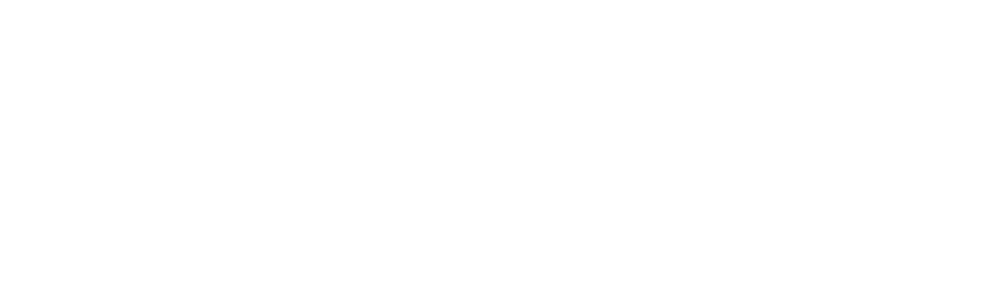

<html lang="en">
  <head>
    <meta charset="utf-8" />
<meta name="viewport" content="width=device-width, initial-scale=1.0" />
<title>Paul Blacklock Rails | Web Dev: Rails app and web developer</title>

<meta name="description" content="Rails Developer" />

<link rel="stylesheet" href="css" />

  </head>
  <body class="default ">
    <header>
 
</header>

    <main>
      <h3>Welcome | Bienvenue</h3>

Hello, nice to meet you and thank you for stopping by to visit my site.

I’m Paul Blacklock. An independent App &amp; Web Developer using the Ruby on Rails framework along with modern technologies to build and quickly deploy modern websites and apps to market.

<b>Custom software</b> with Ruby on Rails is fast and reliable.

Technologies

<ul type="circle">
<li> Ruby on Rails </li>
<li> AngularJS </li>
<li> Typescript/Javascript </li>
<li> HTML5 | CSS3 | Bootstrap | Tailwind</li>
<li> Node.js </li>
</ul>

I am presently working on a full time website deployment project for 2022. Will be available to hire; such as building iOS/Android apps and web development work in early 2023.

Love to develop and deliver exciting new ideas to market with clients.

Sincerely,

      <p1><b>Paul Blacklock</b></p1>

Get in touch, Here's my email address: <a href="mailto:paulblacklock@proton.me">paulblacklock@proton.me</a> 
 

 2022 &#169; Paul Blacklock. 

 
